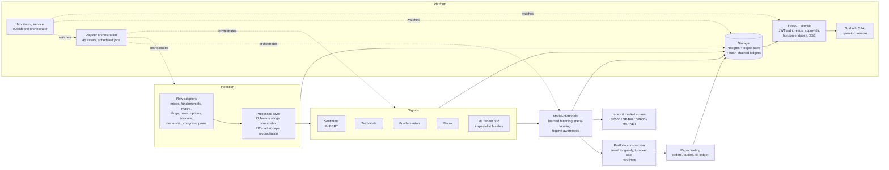
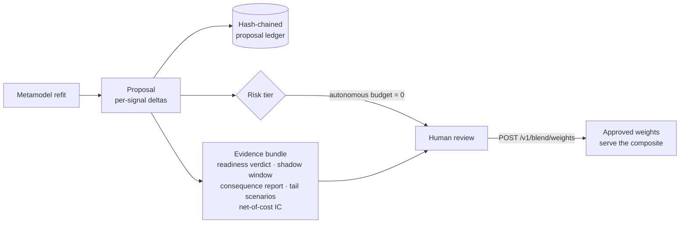
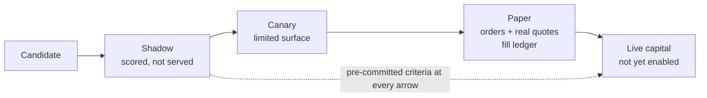
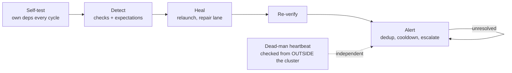

# Corvus: A Multi-Signal Equity Research and Trading Platform

**White paper — revised 2026-09-01** (supersedes the 2026-08-03 draft). This
document explains how Corvus operates for readers outside the project: what
it builds, the disciplines it enforces, and where its boundaries are. It
describes a working system under active development; the Status section is
honest about which parts are live, which are shadow-only, which are designed
but unbuilt — and what the system's own audit machinery currently says about
its flagship model.

---

## 1. What Corvus is

Corvus is a platform for producing presentable, consumable financial
analytics on US equities, built to ultimately serve as the backend for live
trading systems. It ingests raw market, fundamental, macroeconomic, and text
data; derives a large point-in-time feature library; trains machine-learning
models that emit trading signals; blends them into composite analytics;
constructs benchmark-relative portfolios under pre-committed risk limits;
and paper-trades the result while a monitoring service watches the whole
plant.

The central architectural idea is a **multi-signal chain**:

> features are inputs to models; models produce signals; a
> **model-of-models** consumes all signals and produces the outputs that
> feed trading decisions.

No single model is trusted. Every signal is an input to a learned blending
layer, and the blending layer itself only ever *proposes* changes that a
human approves.

The second idea, which shapes almost every module: **most quant platforms
fail on process, not on modeling** — lookahead bias, silent data corruption,
overfit selection, after-the-fact rationalization of limits, unauditable
decisions. Corvus treats defenses against those failure modes as first-class
engineering, on par with the models themselves. This paper quotes the
system's own incident record freely, because the defenses exist precisely
because each failure mode has been observed here at least once.

## 2. Design principles

Six disciplines recur throughout the codebase; every later section is an
instance of at least one.

1. **Point-in-time honesty.** Every feature respects the gap between what a
   value *refers to* and when it *became knowable*. Fundamentals step at
   filing date; short interest at publication; macro series shift by
   *measured* release lags, and materially-revised series carry true vintage
   axes. A standing no-lookahead test mutates future data and asserts no
   feature changes.
2. **Evaluation numbers must defend themselves.** Every experiment is
   charged against a per-research-question trial ledger, judged at a
   corrected effective sample size, and gated by thresholds calibrated on
   regenerable zero-edge Monte Carlo nulls — the gate's false-pass rate is a
   measured number, not a hope.
3. **Degrade, don't crash — but never silently.** Missing inputs are
   expected states: the unit records a reason and the run continues. The
   complement is the **zero-rows contract**: producing nothing without
   saying why flags the run.
4. **Machines propose; humans approve.** Model promotion, blend-weight
   changes, and feature activation are human acts against pre-committed,
   content-hashed criteria written *before* the evidence arrives.
5. **Everything is versioned and auditable.** Provenance timestamps on every
   dataset; full evaluation snapshots in the model registry; hash-chained
   proposal ledgers; content-hashed policy versions; retention that prunes
   only reproducible artifacts, never evidence.
6. **Documentation is part of the change.** Changelog, decision record, and
   open-question updates land in the same commit as the code.

## 3. System overview



Orchestration assets are thin wrappers by rule: load inputs, call pure logic
in importable modules, persist, report metadata. Business logic never lives
inside the orchestrator, which keeps every computation unit-testable without
infrastructure. The standing cadence:

| Job | What it does | Schedule |
|---|---|---|
| `daily_job` | membership → corporate actions → prices → filings/news/options/macro → feature panel → snapshots | 06:30 ET Tue–Sat (T-1) |
| `daily_signals_job` | the signal families → composite → index/market scores → shadow composites | daily, partitioned |
| `ml_model_job` | ranker refit: train, calibrate, register, champion-gate | monthly |
| `family_models_job` / `metamodel_job` | specialist families / combiner + meta-labeling + proposal | monthly |
| `maintenance_job` | retention, source quality, market caps, filing texts, short interest, insiders | weekly, Sun |
| `paper_trading_job` | champion → orders → quotes → fill ledger | weekdays 09:35 ET |

Monitoring deliberately runs *outside* this schedule and this process — a
dead orchestrator cannot report its own death (§11).

## 4. The data layer

Ingestion is split into two layers, and every module lives in exactly one:
**`ingestion/raw/`** (adapters that fetch and save *unchanged* — all HTTP
through one shared client with per-vendor rate limiters) and
**`ingestion/processed/`** (everything *derived*: the feature library, macro
composites, point-in-time market caps, source-quality scoring,
reconciliation harnesses).

Current scale, measured on the live deployment (2026-09-01):

| Store | Size |
|---|---|
| Price rows | 3.62M (1,512 tickers, 2016-07 → present) |
| Signal rows | 14.5M across 6 emitting families |
| Scored cross-section | 1,693 names/day |
| Registered features | 132 across 17 wings |
| Dagster assets | 46 |
| Macro catalog | ~50 curated FRED series, 11 with true vintage axes |

### Defenses with an incident behind each

Each shared primitive below exists because the failure it prevents was
observed in this system — most reached production before being caught.

| Primitive | The failure it answers |
|---|---|
| Atomic writes (`core/atomic.py`) | a concurrent reader saw a half-written parquet as a valid-looking *partial* dataset — which every degrade path faithfully read as "no data" |
| `safe_ratio` (`core/numeric.py`) | a collapsing denominator yields a huge *finite* value that survives every downstream check and dominates its cross-section |
| Exchange-session guard (three price readers, one shared function) | one vendor served **eight weekend rows** for one ticker at 1/1750× the true price; on a weekend that name *was* the equal-weight market, saturating the changepoint detector at probability 1.0 |
| Re-entry gap masking (`core/gaps.py`) | a delisted-then-relisted name looks continuous to a rolling window, reporting a 60-day "return" nobody could have traded |
| Saturation reporting (`core/saturation.py`) | per-key fetch caps truncate silently — three separate times, most visibly every ticker holding *exactly three* 10-Ks |
| Bounded forward-fill (doctrine, per-wing bounds) | an unbounded carry priced Visa off a 2010 share count for sixteen years; "we no longer know" must render as *absent*, not the last thing we knew |
| Degrade-path persistence (`core/degrade.py`) | a strictly-worse fallback engaged for **seven weeks** while every build silently used starter wordlists |
| Plausibility gates at ingestion | vendors and SEC filers do emit impossible values — share counts implying quadrillion-dollar companies, filings dated in the future; each class seen here reached production once |
| Chunked panel readers (`storage/panels.py`) | materializing a full table as Python tuples cost 17× the memory of the identical panel read chunked — it OOM-killed the API pod once and the monthly metamodel job once, months apart, through two *separate* copies of the same defect |

Beyond the table: **own-source price adjustment** (raw closes adjusted by
Corvus's own corporate-action log, reconciled against vendor-adjusted
series; two independent vendors' raw closes agree to a median relative
difference of 2×10⁻⁸), **delisted-universe reconstruction** (point-in-time
membership cross-checked against N-PORT filings, per-class exit conventions
with Shumway loss imputation, a Form 25 evidence sweep, and a splice
pipeline behind a four-gate acceptance battery), and **measured macro
vintages** (one stored example: industrial production for a single month
reads 109.5 as known at the time, 101.7 as revised today — vintage choice
can overturn conclusions, and Corvus stores the version that was knowable).

## 5. The feature library

Derived features are organized into **wings** — self-registering modules
each producing a group of per-(date, ticker) features from raw inputs. Three
rules hold everywhere: trailing information only, honest availability lags,
and registration (formula/source, lookback, availability lag, content-hashed).
A wing whose input is missing skips with a recorded reason, so the live
feature count is itself a coverage signal.

| Wing | Carries (abridged) |
|---|---|
| `technicals_extended` | 12-1 momentum, reversal, 52w-high proximity, lottery/skew, vol-of-vol, Amihud illiquidity, beta/idio-vol |
| `fundamentals` | PIT factor set stepped at *filing* dates, seasonal SUE (PEAD), TTM levels, Ohlson O, Beneish M |
| `size` / `valuation` | log PIT cap, turnover, composite issuance; PIT ratios + the enterprise-value axis, staleness-capped |
| `sector` / `macro_exposure` | sector membership (exposure only) and momentum; rolling betas to macro factor *innovations* |
| `events` / `insiders` | dividend initiation/omission, recency, tenure; routine-vs-opportunistic insider split (Cohen-Malloy-Pomorski) |
| `short_interest` / `options` | SI level vs days-to-cover squeeze split, publication-date PIT; ATM IV, skew, put-call OI |
| `filing_text` | readability, LM-dictionary tone, tone change, NT/amendment flags — stepped at filing date |
| `analyst` / `labor` / `segments` | grade revisions, coverage, estimate dispersion (vintage-stepped); hiring rate; segment HHI and foreign share |
| `peers` / `congress` / `ownership` | Cohen-Frazzini lead-lag (vintage-stepped peer sets); congressional-trading overlay (disclosure-date PIT); 13D/G stake events |

A YAML-driven **pipeline step engine** turns the panel into modeling
datasets: cleaning, cross-sectional normalization (gaussian-rank, graduated
by ablation) and neutralization, labeling, per-date median imputation with
the missing-indicator option, a four-layer selection stack, optional
compression, and purged+embargoed cross-validated backtesting. New
methodology ships default-off until an ablation earns its place.

## 6. Signals and the model layer

Four signal families (FinBERT sentiment, technicals, fundamentals, macro)
plus generated specialist families emit a common `SignalRecord` contract
into shared storage; one repository module maps records for both the
pipeline and the API, so the two paths cannot drift.

The flagship model is a **cross-sectional gradient-boosted ranker**: it
learns to *order* the cross-section rather than predict returns pointwise —
matching how portfolio construction and rank-based evaluation actually
consume predictions. Its discipline:

- **Expanding-window walk-forward** — each out-of-sample date is scored only
  by a model trained strictly earlier, so the persisted OOS series is
  deployable by construction:

```
train ──────────►│ score
train ───────────────────►│ score
train ────────────────────────────►│ score        ... × seed ensemble
─ time ─────────────────────────────────────────► │ DEV ─── │ FINAL (untouched holdout)
```

- **A linear baseline trained on every run** — the standing comparison a
  ranker must justify itself against.
- **A seed × window ensemble that reaches serving**, not just evaluation.
- **Champion promotion through a shadow gate**, now **horizon-adjusted**:
  candidate and champion ICs are compared on the same horizon via √h scaling
  (cross-sectional IC grows ≈ √horizon), because an unadjusted comparison
  let a horizon change masquerade as model improvement.

The model lineage to date:

| Version | Date | Label | Features | OOS mean IC | FINAL IC |
|---|---|---|---|---|---|
| v1 | 2026-07-29 | 20d raw | 8 | — | — |
| v2 | 2026-08-01 | 20d raw | 8 | 0.0290 | 0.0589 |
| v3 | 2026-08-31 | **63d vol-scaled** | 13 (7 wings) | 0.0507 | 0.0267 |
| v4 (champion) | 2026-09-01 | 63d vol-scaled | 13 | =v3 (refit saw no new data) | =v3 |

**The prediction horizon is a served, monitored surface.** Every composite
score carries a horizon chip on the console, and `GET /v1/config/horizon`
reports **two** numbers — the *configured* target (63d vol-scaled) and the
*served* one, derived from each champion's registered label column — because
they disagree whenever config moves before a refit lands. Constants are
mirrored, never imported across service boundaries, and drift-tested so a
horizon changed in one place fails the build.

**Training/serving parity is enforced, not assumed.** The training panel is
dense (per-date median imputation after normalization), and live scoring now
mirrors the exact recipe recorded in each champion's metadata —
normalization method, then imputation, in the pipeline's own order. The rule
earned its test the hard way: on the 63d champion's *first* live-scored day,
the serving path complete-cased where training had imputed, and the emitted
cross-section collapsed from 1,693 names to 347 before monitoring caught it
within the hour. Fixed same day; the order is pinned by test.

## 7. The model-of-models

The blending layer is the system's learned core. A linear combiner (rank
aggregation, regime-gated, and listwise-ranker variants as first-class
options) learns to weight the signal families under the same walk-forward
discipline as the model layer, on signals standardized by trailing
cross-sectional dispersion; coefficients convert back to raw-unit weights so
serving is unchanged. Around it: **meta-labeling** (a different-family model
predicts whether the combined signal is currently trustworthy and sizes it,
adopted only under a pre-committed net-of-turnover policy), **regime
awareness** (persistence-filtered classifier, Bayesian online changepoint
detection, regime-stratified evaluation as a standing audit output), and
**fold-count graduated shrinkage** (a newly-admitted family ramps toward
full weight instead of jumping).



Every proposal appends to the ledger with a size-based risk tier — the
default policy gives autonomous tiers a **zero budget**, so every real
change routes to a person — plus a criteria-versioned readiness verdict,
cost-adjusted shadow evidence, a same-day consequence report (a
dispersion-collapsing proposal is blocked at proposal time), and a
tail-scenario report that is required and reported but never a gate.

**Index and market scores.** The daily composite also rolls up under each
index's own point-in-time cap weights — SP500, SP400, SP600, and the
whole-universe MARKET — served as headline cards on the console. The weights
are the documented raw-cap approximation of the float-adjusted official
methodology, never official S&P weights, and every surface says so; each
scope refuses independently, with a reason, on stale weights or insufficient
covered weight.

**The live blend today is `ml_ranker` at weight 1.0.** The ML signal joined
at weight zero, cleared its governed evidence bars, and now carries the
whole composite — which the governance queue explicitly flags as a
concentration decision awaiting an approved fallback vector (§13).

## 8. Evaluation discipline

The machinery that decides whether any number in the system is believed —
the part of Corvus most shaped by hard-won lessons.

**Trial accounting.** Every experiment runs under a pre-declared research
question slug, and multiple-testing corrections are charged against the
question's *full* trial count — including automated searches (formulaic
alpha search reports every formula evaluated; hyperparameter optimization
charges its entire search space).

**Effective sample size.** Overlapping H-day windows make raw counts a
fiction: 2,248 overlapping observations at a 20-day horizon contain ~112
independent ones, and at the current 63-day horizon a year holds roughly
**four** independent windows. Significance is judged at
n_eff = min(Newey-West estimate, n/H).

**A calibrated, two-leg promotion gate.** A candidate must clear a Deflated
Sharpe threshold at n_eff *and* a complementary second leg (Probability of
Backtest Overfitting via combinatorially symmetric cross-validation). The
thresholds are calibrated on a seeded zero-edge Monte Carlo with best-of-K
selection: the original gate turned out to pass **95.5%** of best-of-10
noise; the corrected gate passes **1.9%**, and the null showed the two legs
genuinely complementary (leg-pass correlation ≈ 0.24).

**Leakage auditing as a CI gate.** Mechanical PIT invariants — availability
≤ decision time, provenance present, no future filing dates, purge
respected, price-bar integrity — run in CI over synthetic cases *and* the
actual on-disk artifacts, and the report states its honest boundary:
knowledge lookahead and LLM-pretraining leakage are not mechanically
certifiable.

**Pre-committed limits that bind.** The portfolio layer carries a
pre-committed 300%/year one-way turnover cap. When the measured book
violated it at 1,013%/year, the cap was *enforced* rather than rationalized
— and enforcement **raised** net information ratio from 0.72 to 0.98,
because the excess churn had been noise-trading alpha into costs.

**Audits that bite their own book.** The same machinery is pointed at the
system's own champions: the standing model audit (§13) measured the serving
model's live-relevant IC at a third of its registered headline and produced
pre-registered research to attribute it — findings a marketing document
would omit and this one leads with.

## 9. Portfolio construction and risk

Signal scores become a **benchmark-relative, long-only tiered book**:
overweight the top quantile, underweight the bottom, against
capitalization-weighted benchmark sleeves, under pre-committed limits — the
turnover cap, a per-name active-weight backstop with an early-warning alert
that fires first, and an interim tracking-error tolerance set just above
realized, with a recorded migration path toward per-factor risk budgets.

Supporting machinery: a factor-covariance risk model with shrinkage and
ex-ante tracking error; standing bias tests grading the risk model's own
forecasts; one tail-scenario engine for factor-crash, correlation-regime,
and crowding stresses (long-only scoping guard enforced in code); a
pre-committed crowding-response ladder; capacity analysis inverting the cost
model into net-alpha-versus-AUM; and a staleness **circuit breaker** shared
by the API, the paper loop, and any future live path.

## 10. Paper trading and the promotion path



A daily paper-trading loop turns the champion signal into the tiered book,
applies the turnover cap **through the same code path the backtest uses** (a
compliance limit with two implementations will eventually disagree),
generates order diffs, captures real quotes, and appends to a fill ledger.
That ledger feeds a staged cost-calibration plan keyed to sample size: fill
direction bias is measurable within tens of fills; size sensitivity waits
for hundreds; stress impact is structurally unmeasurable from paper fills
and stays a modeled input. The cost model updates only when the ledger's
confidence interval beats the current assumption, with per-revision caps.

The ML signal's first non-zero blend weight ran through a pre-committed
**flip protocol** — shadow evidence judged at effective sample size, a
cost-adjusted uplift bar, a ramp re-clearing the bar at every step — and has
since completed: the signal now carries the full blend weight. The
protocol's other half is therefore the live one: **automatic demotion
triggers**, specified with the same rigor before the flip, because a
promotion protocol without a demotion protocol is half a decision.

## 11. Operations and monitoring

The platform deploys to a single-node Kubernetes cluster (k3s) with
Postgres, Helm-managed Dagster, and an authenticated ingress. A
deployment-drift verifier compares the repository against the live cluster —
image tags, chart values, manifest environment, and *the image the newest
run actually executed on*, because an orchestrator can hold a stale code
handle and run old code on a correctly-deployed cluster (observed: runs
dying in 30 seconds with exit code 0). Operational scripts ship in
PowerShell + shell pairs, enforced by test.



Monitoring runs outside the orchestrator on that cycle, and its design
points come directly from observed failures:

- **The monitor asserts its own dependencies every cycle** — a misconfigured
  service name once left monitoring blind while it reported healthy cycles.
- **Emission expectations** ask the aggregate question no per-task error
  handling can — a pipeline once emitted zero rows across 2,628 *cleanly
  successful* runs. Where silence is legitimate (a specialist designed to
  stop at its coverage edge), the expectation watches the *consequence*
  (will the next refit refuse?) instead of the silence.
- **A guard's vacuous-pass path is part of its threat model** — a
  blend-identity check once passed on a blend that had collapsed onto one
  member, the exact shape it was built to catch, because it counted families
  that had *emitted* rather than what the config *declared*.
- **The dead-man heartbeat is read from outside**, because nothing inside a
  system can detect its own total failure.

Alerts deduplicate under cooldowns, escalate on consecutive misses, and
re-alert until a human resolves the event. This is not theoretical coverage:
both production defects found on 2026-09-01 were flagged by this layer
(a failed-run scan and a composite row-count anomaly at z = −14) before any
human looked.

## 12. Governance and auditability

The working process is part of the system. Open questions are numbered with
recorded triggers; decisions get briefs with recommended answers; external
research packages are saved verbatim, countersigned, and implemented in
tracked waves; a durable decision register records choices *with their
reasoning*. Post-implementation audits re-derive requirements from source
documents and mechanically verify the code against them — one such audit
found sixteen gaps in a large wave within a day of landing it.

Data lifecycle carries the same rules: retention prunes only reproducible
artifacts; ledgers are append-only and hash-chained; irreplaceable
accumulating datasets are never-prunable *in code*; and a vendor silently
rewriting its own history is detected by re-query, frozen, and flagged.

## 13. Status

**Built and operating** (single-node deployment, daily schedules): the full
ingestion layer and 17-wing feature library; four signal families plus
specialists; the 63-day ML ranker with walk-forward evaluation and
horizon-adjusted champion governance; the blending layer with meta-labeling
and regime machinery (proposals only); index/market composite scores;
portfolio construction with enforced limits; daily paper trading; the API,
operator console, and monitoring; and the evaluation machinery above — with
~3,700 tests, 248 typed source files under mypy, and a CI coverage ratchet
(floor 80%, measured 82.7%; raised as it climbs, never lowered).

**Current champion health — stated plainly.** The system's own standing
audit (2026-09-01) measured the serving model's per-year out-of-sample rank
IC in monotone decay:

| Year | 2020* | 2021 | 2022 | 2023 | 2024 | 2025 | 2026 |
|---|---|---|---|---|---|---|---|
| mean IC | −0.174 | −0.001 | +0.039 | **+0.141** | +0.111 | +0.069 | **+0.030** |

*(2020 from August — warm-up folds.)* The registered headline (0.0507) is
propped by 2023-24; the final-holdout figure (0.0267) *is* the trailing
year. At a 63-day horizon each year holds only ~4 independent windows, so
single-year numbers are weak — the four-year monotone trend is the robust
object. The promotion that produced this champion changed four things at
once (horizon, target transform, feature set, evaluation sample), of which
the gate now corrects one; a five-cell decomposition and a decay-attribution
study are pre-registered and awaiting commissioning. Neither legacy
model-health check could see a positive-but-decaying IC; a trend-aware
replacement is queued. This finding is why the composite currently rides one
signal at weight 1.0 *with the concentration flagged*, and why no capital is
live.

**Explicitly not yet real:** no live capital is traded. A fallback weight
vector for the blend awaits approval. Several governance numbers are
interim-but-binding with pre-committed replacement triggers.

**Designed but unbuilt:** the dedicated backtester (Phase 8), the portfolio
optimiser replacing tiered construction (Phase 9), the research UI
(Phase 10).

## 14. Limitations and honest boundaries

- Corvus runs on free and low-cost data by design, constraining history
  depth (reconstructed small-cap membership before 2020 is weighted
  accordingly), estimate data (consensus history accumulates forward from
  snapshots — it cannot be backfilled honestly), and cost-model validation.
- The evaluation panel is a dense rectangle: names outside the live universe
  are scored on imputed medians, which serving now mirrors exactly but which
  is an open design question for what the registered evaluation *measures*.
- Mechanical PIT auditing cannot certify *knowledge* lookahead or
  LLM-pretraining leakage in text-derived signals; these are managed by
  process and stated rather than hidden.
- Paper-trading evidence cannot measure market impact; stress-condition
  costs remain modeled inputs at any ledger size.
- Backtested and shadow figures quoted here are research measurements under
  stated assumptions, not live track records. The champion-health table
  above is the system's own current, unflattering read of its flagship
  model. Nothing in this document is investment advice.

---

*Corvus is a working system and this revision describes it as of
2026-09-01; component counts and measured figures move with development. The
repository's `CHANGELOG.md`, `OPEN_QUESTIONS.md`, and decision register are
the always-current sources of truth.*
